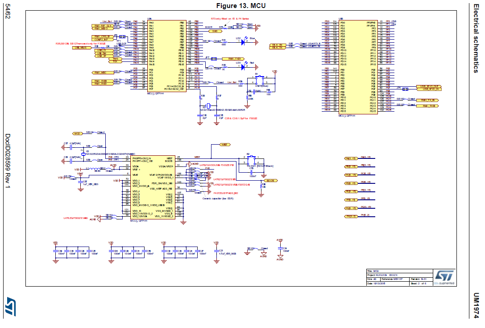
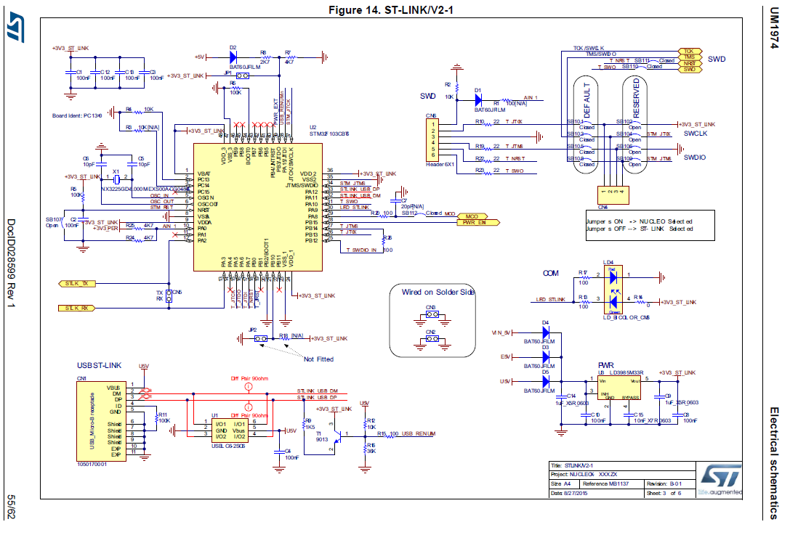
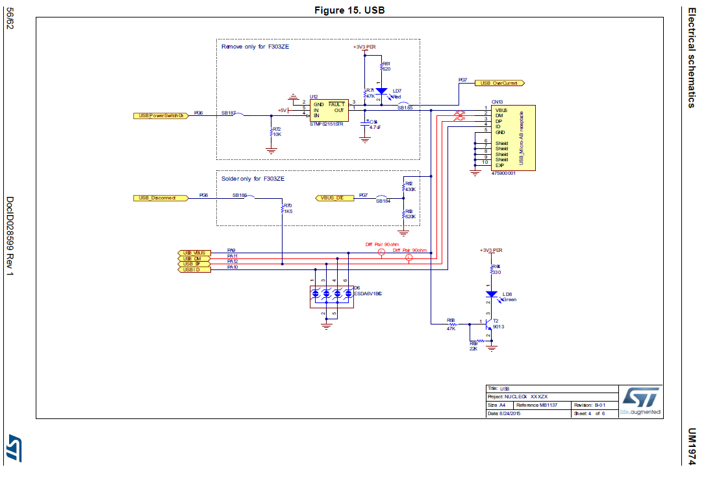

# STM32F4_Nucleo-144 / Esquema Eléctrico Nucleo-144.
 
 
<H1>Top and Power</H1>

<H1>Mcu</H1>

<H1>st-link/v2-1</H1>

<H1>Usb</H1>

<H1>Ethernet</H1>
 
<H1>Extension connectors</H1>

 
<H1>Conector 7 y 10</H1>

<H1>Conector 8 y 9</H1>
